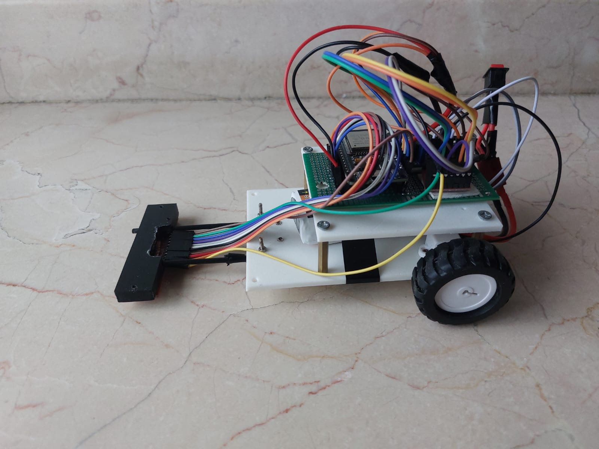

# High-Speed ESP32 Line Following Robot (16-Sensor PID)

[](https://www.espressif.com/)
[](./firmware/)
[](LICENSE)

An engineering portfolio project demonstrating embedded C++ programming, non-blocking control loops, 16-channel analog sensor multiplexing, custom 3D-printed mechanical design, and adaptive PD curve steering

---


## System Overview

This robot is designed for autonomous line tracking at high speeds on complex tracks featuring sharp bends, cross-intersections, and variable curvature. Powered by an ESP32 micro-controller, it uses 16 analog TCRT5000 sensors read via dual 8-channel analog multiplexers to achieve sub-millimeter positional resolution.

---

## Key Engineering Features

* **16-Channel Analog Array:** Utilizes dual 74HC4051 multiplexers on ESP32 **ADC1** pins to avoid ADC2 Wi-Fi channel locks and optimize pin usage.
* **Continuous Line Centroid:** Calculates position on a normalized coordinate grid from $-7500$ (far left) to $+7500$ (far right) using calibrated weighted averaging.
* **Adaptive Speed Scaling:** Dynamically decreases motor PWM during sharp turns ($\vert{}error\vert{} > 2500$) and accelerates on straightaways to maximize stability.
* **Line Loss Trajectory Recovery:** Retains turn direction memory upon temporary line loss to safely execute pivot maneuvers back onto the track.
* **Custom Mechanics:** 3D-printed chassis with extended sensor boom geometry and flexible TPU 95A high-traction tires.

---

## Hardware Architecture & Specifications

| Subsystem | Components / Specs |
| :--- | :--- |
| **Microcontroller** | ESP32-WROOM-32 (240 MHz Dual-Core, 32-bit) |
| **Sensors** | 16x TCRT5000 IR Phototransistors |
| **Multiplexing** | 2x 74HC4051 8-Channel Analog Multiplexers |
| **Motor Driver** | TB6612FNG Dual MOSFET H-Bridge |
| **Motors** | 2x Micro Metal Gearmotors (1000 RPM @ 6V) |
| **Power System** | 2S 7.4V LiPo Battery + Dedicated Buck Regulator (5V 3A) |
| **Chassis & Wheels** | 3D-Printed Frame, 32mm PLA Wheels with TPU Tires |

---

## Firmware Structure

```text
firmware/main/
├── main.ino        // Primary setup, 100 Hz loop, state machine
├── config.h        // Hardware pinouts, PID gains, speed thresholds
├── sensor.h / .cpp // 16-channel MUX driver & weighted centroid calculation
├── motor.h / .cpp  // TB6612FNG differential motor drive
└── pid.h / .cpp    // Discrete PD control algorithm & error math


